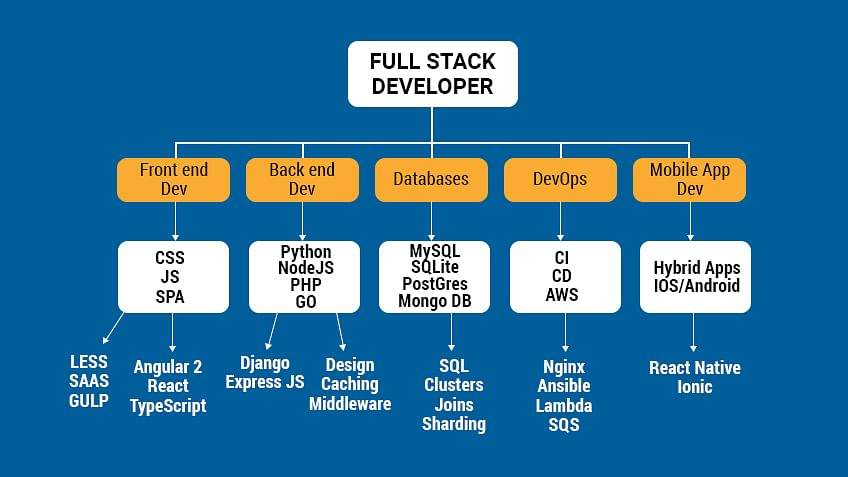

  

<h3 align="left">Programming Languages</h3>
<table>
  <tr>
    <td></td>
    <td></td>
    <td></td>
    <td></td>
    <td></td>
    <td></td>
    <td></td>
    <td></td>
    <td></td>
  </tr>  
</table>
  
<h3 align="left">Technologies</h3>
<table>
  <tr>
    <td></td>
    <td></td>
    <td></td>
    <td></td>
    <td></td>
    <td></td>
    <td></td>
    <td></td>
    <td></td>
    <td></td>
    <td></td>
    <td></td>
    <td></td>
  </tr>  
</table>

<h3 align="left">Operating Systems</h3>
<table>
  <tr>
  <td></td>
  <td></td>
  <td></td>
  <td></td>
  </tr>  
</table>

<!--   GitHub stats graph -->
<h1 align="center">📈 GitHub Activity Graph: 📊</h1>

 &nbsp; | &nbsp;
--- | --- 
 | 

  

## Git profile Trophies

 
   

  
  

---
  *If you liked my profile, you can Star ⭐ the repo and if you want to use this template you can Fork it.*
---

If you want to contribute to any of my repositories, feel free to submit PRs, issues and email me. Pick a slot if you'd like to meet me and chat about proposals and ideas - but make sure to describe the agenda
  
